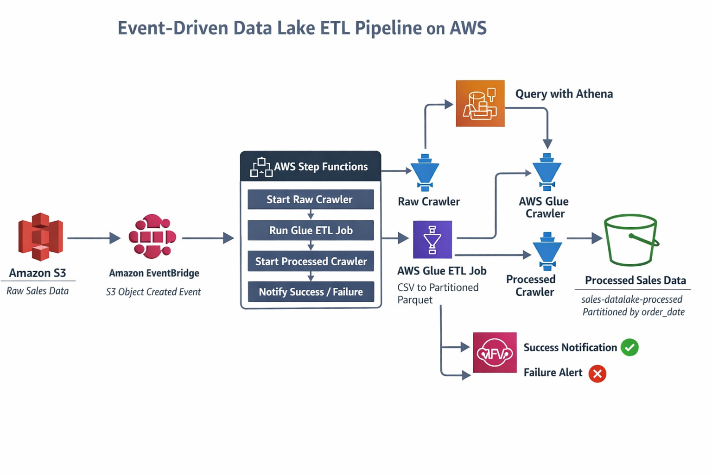

# Serverless Event-Driven Data Lake ETL Pipeline on AWS

## 📌 Overview
This project implements a **fully serverless, event-driven data lake ETL pipeline** on AWS.  
The pipeline automatically processes newly uploaded sales data using **Amazon S3, AWS Glue, AWS Step Functions, Amazon EventBridge, Amazon Athena, and Amazon SNS**.

The design focuses on **incremental processing, deterministic execution, fault tolerance, and cost efficiency**, following real-world production best practices.

---

## 🏗️ Architecture



### High-Level Flow
1. New sales data is uploaded to the **Raw S3 bucket**
2. **Amazon EventBridge** detects the S3 object creation event
3. **AWS Step Functions** orchestrates the ETL workflow
4. **AWS Glue Crawlers** update metadata in the Glue Data Catalog
5. **AWS Glue ETL (PySpark)** transforms raw CSV data into partitioned Parquet
6. Transformed data is stored in the **Processed S3 bucket**
7. **Amazon Athena** enables SQL-based analytics
8. **Amazon SNS** sends success or failure notification

---

## 📂 Data Lake Structure

### S3 Buckets
```

sales-datalake-raw-<env>/
└── sales/orders/ingest_date=YYYY-MM-DD/*.csv

sales-datalake-processed-<env>/
└── sales/orders/order_date=YYYY-MM-DD/*.parquet

````

### Data Layers
| Layer | Purpose |
|-----|--------|
| Raw | Immutable landing zone for source data |
| Processed | Cleaned, transformed, analytics-ready data |

---

## 🔁 Event-Driven ETL Workflow

### Trigger
- S3 ObjectCreated event
- Captured by Amazon EventBridge

### Orchestration
AWS Step Functions coordinates:
- Raw Glue Crawler (with polling)
- Glue ETL Job (deterministic, file-based processing)
- Processed Glue Crawler (with polling)
- SNS notifications

### Deterministic Processing
Each ETL execution processes **only the file that triggered the event**, using EventBridge metadata:
- S3 bucket name
- S3 object key

This eliminates crawler timing race conditions.

---

## 🔧 AWS Services Used

- **Amazon S3** – Data lake storage
- **AWS Glue** – Crawlers, Data Catalog, PySpark ETL
- **AWS Step Functions** – Workflow orchestration
- **Amazon EventBridge** – Event-driven triggers
- **Amazon Athena** – Serverless SQL analytics
- **Amazon SNS** – Email notifications
- **Amazon CloudWatch** – Logging and monitoring
- **AWS IAM** – Secure access control

---

## 🧪 Sample Dataset

**sales_orders.csv**
```csv
order_id,customer_id,product,quantity,price,order_date
1001,C001,Laptop,1,75000,2025-01-01
1002,C002,Mouse,2,500,2025-01-01
1003,C003,Keyboard,1,1500,2025-01-02
````

---

## 🔄 ETL Transformations

* Drop null records
* Cast data types
* Derive `total_amount = quantity * price`
* Convert CSV → Parquet
* Partition data by `order_date`
* Append-only incremental writes

---

## 📊 Querying with Athena

### Example Queries

**Daily Revenue**

```sql
SELECT order_date, SUM(total_amount) AS revenue
FROM processed_orders
GROUP BY order_date
ORDER BY order_date;
```

**Top Selling Products**

```sql
SELECT product, SUM(quantity) AS total_units
FROM processed_orders
GROUP BY product
ORDER BY total_units DESC;
```

---

## 🔔 Notifications & Monitoring

* SNS sends email alerts on:

  * Successful ETL completion
  * Pipeline failure
* CloudWatch provides:

  * Glue job logs
  * Step Functions execution history

---

## 🔐 Security & Best Practices

* IAM roles scoped per service
* Serverless architecture (no EC2)
* Columnar storage (Parquet)
* Partition pruning in Athena
* Append-only ETL for incremental safety

---

## 💡 Key Design Decisions

* EventBridge used instead of polling
* Step Functions used for orchestration and retries
* Crawlers treated as metadata sync, not execution triggers
* Deterministic ETL using S3 object-level input
* Notifications sent only after data is queryable

---

## 🏆 Highlights

* Designed a **serverless, event-driven data lake ETL pipeline** on AWS
* Implemented **incremental, deterministic Glue ETL** using EventBridge metadata
* Orchestrated workflows using **AWS Step Functions with retries and failure handling**
* Optimized analytics using **partitioned Parquet and Athena**
* Integrated **SNS notifications** for operational visibility

